<div align="center">

# 🏋️ Haze Fitness — Gym Management System

**A production-grade, full-stack platform for running a modern fitness club — members, trainers, subscriptions, attendance, classes, POS, reports and online payments, in one clean workspace.**

[](LICENSE)
[](https://nodejs.org)
[](https://react.dev)
[](https://expressjs.com)
[](https://www.mysql.com)
[](https://razorpay.com)
[](https://github.com/sabynextdoor/HazeFitness/releases)
[](https://github.com/sabynextdoor/HazeFitness/pkgs/container/hazefitness)
[](#contributing)
[](#author)

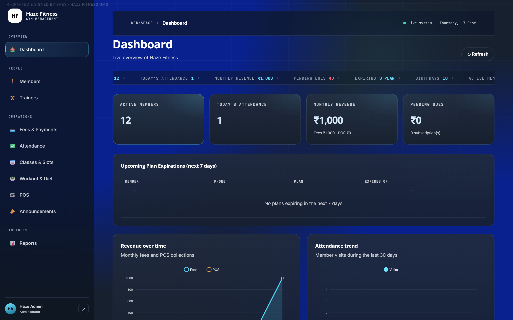

</div>

---

## Table of Contents

- [Overview](#overview)
- [Screenshots](#screenshots)
- [Features](#features)
- [Tech Stack](#tech-stack)
- [Architecture](#architecture)
- [Project Structure](#project-structure)
- [Getting Started](#getting-started)
  - [Prerequisites](#prerequisites)
  - [Step 1 — Clone the repository](#step-1--clone-the-repository)
  - [Step 2 — Create the MySQL database](#step-2--create-the-mysql-database)
  - [Step 3 — Configure and run the backend](#step-3--configure-and-run-the-backend)
  - [Step 4 — Run the frontend (development)](#step-4--run-the-frontend-development)
  - [Step 5 — Production build (single-server deploy)](#step-5--production-build-single-server-deploy)
  - [Run with Docker](#run-with-docker)
  - [Default credentials](#default-credentials)
  - [Email OTP in this demo](#email-otp-in-this-demo)
- [Environment Variables](#environment-variables)
- [Online Payments with Razorpay](#online-payments-with-razorpay)
- [API Reference](#api-reference)
- [Deployment](#deployment)
- [Security](#security)
- [Troubleshooting](#troubleshooting)
- [Roadmap](#roadmap)
- [Contributing](#contributing)
- [Author](#author)
- [Changelog](#changelog)
- [License](#license)

---

## Overview

**Haze Fitness GMS** is a complete gym/club management system built for real day-to-day operations. It ships two experiences from one codebase:

- **Staff / Admin workspace** — the full back-office: members, trainers, fee plans and subscriptions, attendance, class scheduling, workout & diet planning, point-of-sale, announcements, and exportable reports.
- **Member self-service portal** — members log in to see their membership, dues and payment history, book classes, view their assigned workout/diet plans, and **pay online**.

The stack is deliberately boring and dependable: **Express + MySQL** on the backend and **Vite + React (React Router)** on the frontend. No black boxes — just clean REST endpoints, a normalised SQL schema, and a hardened session layer (HTTP-only cookies) that separates **staff** and **member** sessions.

> Crafted and signed by **Saby** — the project embeds hidden authorship watermarks (runtime build-time signature, a faint on-screen/print mark, and a persistent `X-Crafted-By` response header) so attribution survives forks and clones.

---

## Screenshots

**Login & member portal**

| Sign in | Member portal |
| :---: | :---: |
| 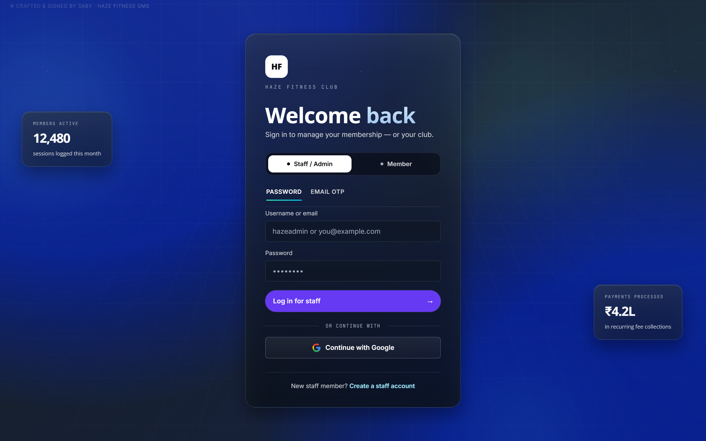 | 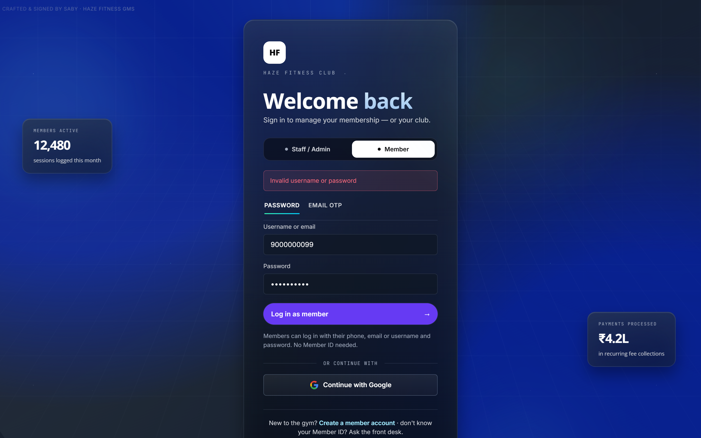 |

**Staff workspace**

| Dashboard | Members |
| :---: | :---: |
|  | 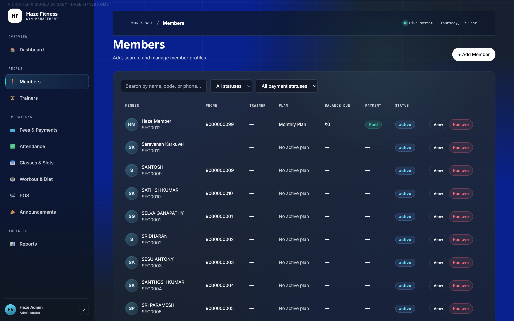 |

| Member profile | Fees & payments |
| :---: | :---: |
| 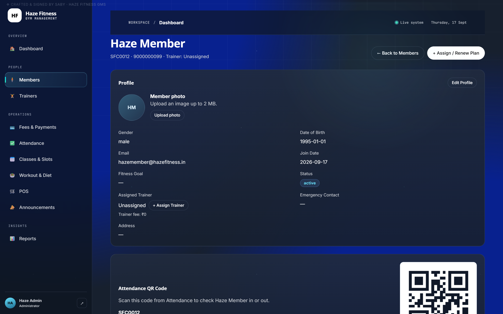 | 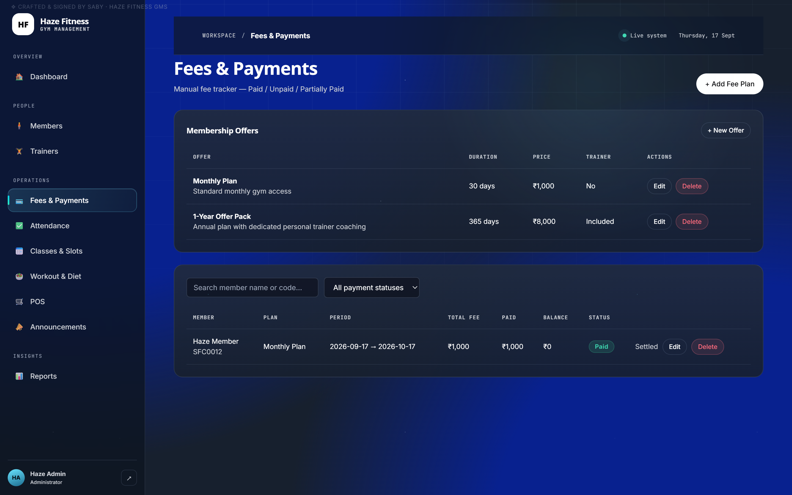 |

| Attendance & QR check-in | Classes & slots |
| :---: | :---: |
| 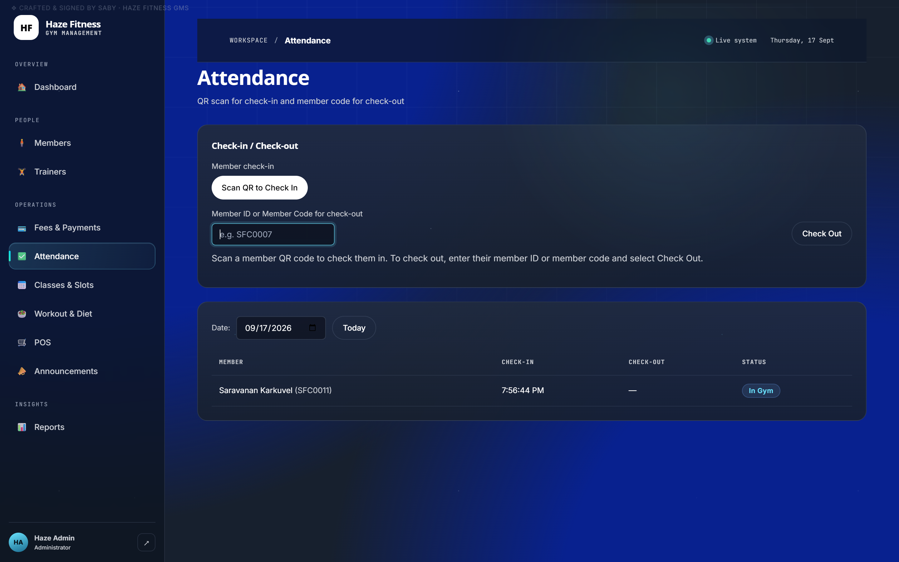 | 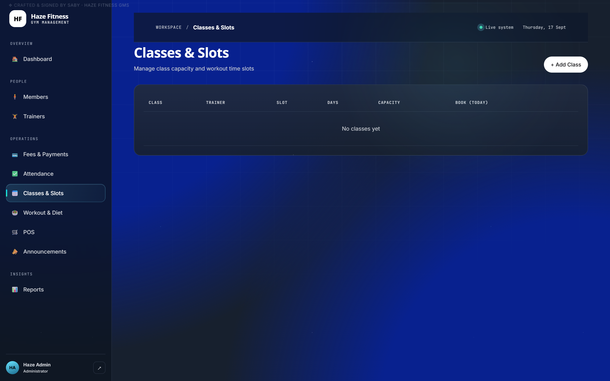 |

| Workout & diet plans | Point of sale |
| :---: | :---: |
| 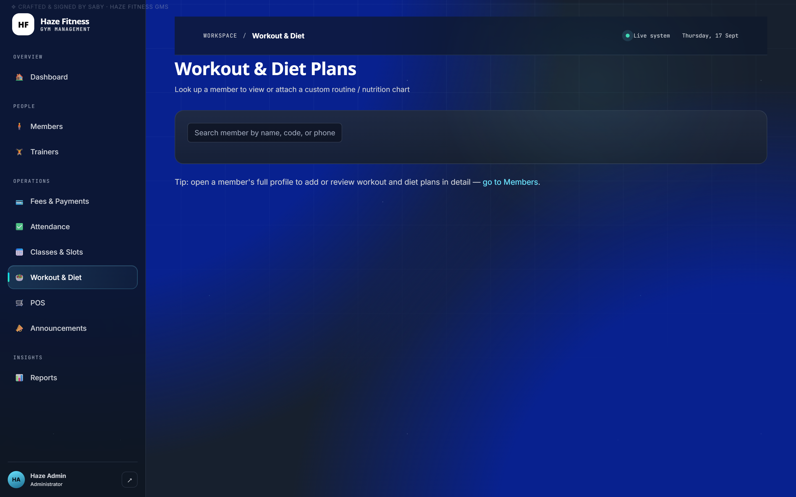 | 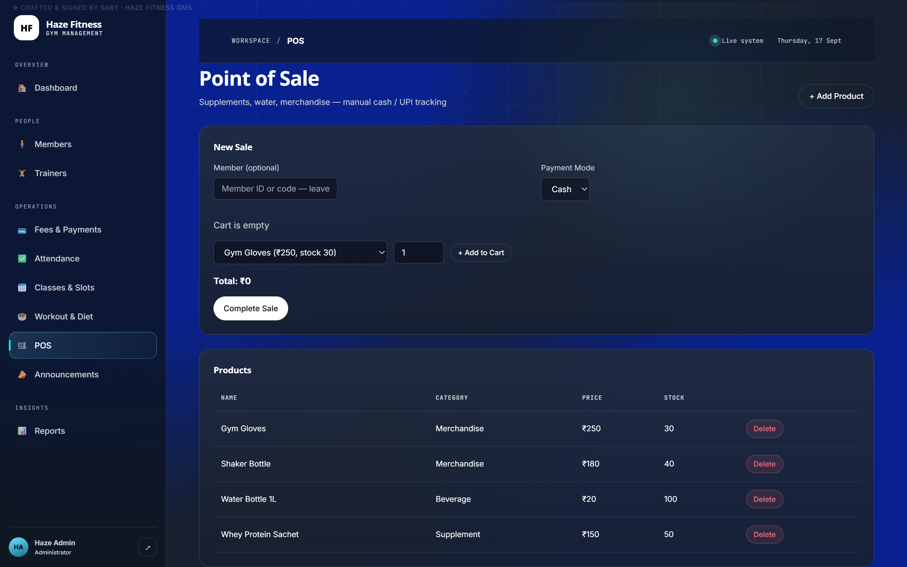 |

| Reports & insights | Online payment (Razorpay) |
| :---: | :---: |
| 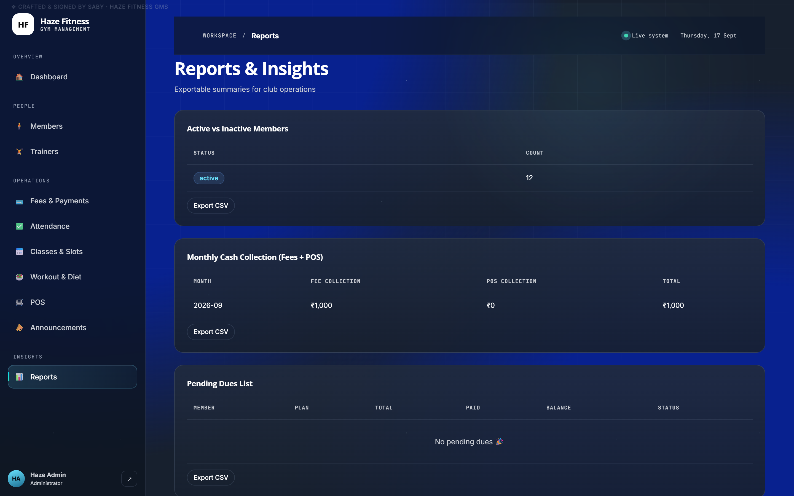 | 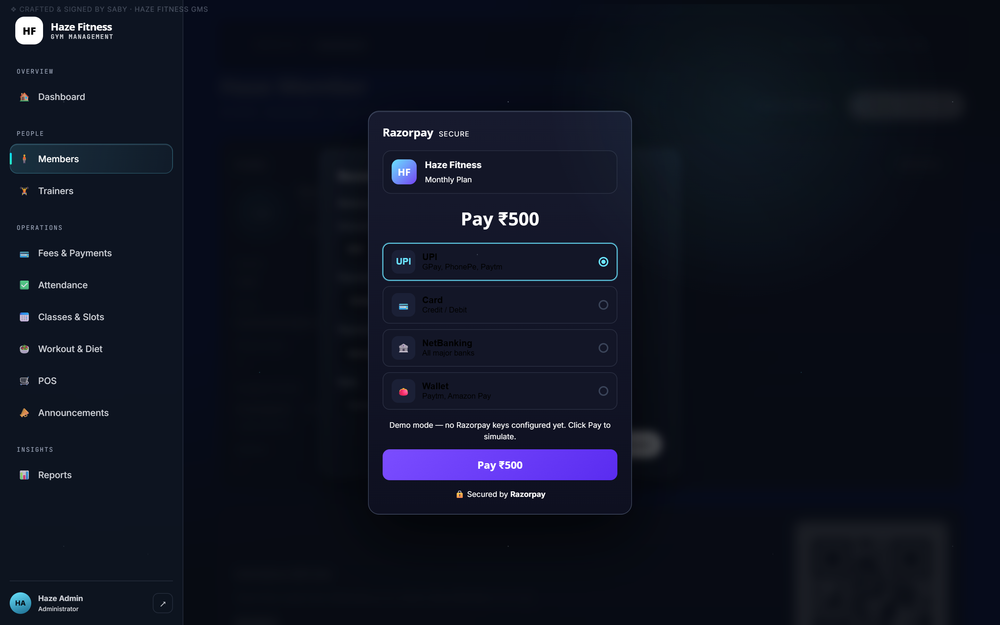 |

---

## Features

<table>
<tr><td valign="top" width="50%">

**Members & People**
- Member directory with search + status filters
- Full member profile: contact, plan, trainer, history
- Progress tracking (body metrics over time)
- Trainer management and member↔trainer assignment
- Active / inactive lifecycle handling

**Fees & Payments**
- Reusable fee plans and time-limited offers
- Subscriptions with generated `balance_due` / `payment_status`
- Record payments (Cash, UPI, Card, Online, Other)
- **Online payments via Razorpay** (UPI/Card/NetBanking/Wallet)
- Printable receipts and WhatsApp payment reminders

</td><td valign="top" width="50%">

**Operations**
- Attendance check-in/check-out with **QR code scanning**
- Attendance streak tracking
- Classes & time slots with capacity and member bookings
- Workout & diet plan builder per member
- POS for supplements / water / merchandise
- Announcements broadcast
- Reports with **JSON and CSV export**

**Accounts & Access**
- Staff and Member login (separate sessions)
- Password **and** Email OTP sign-in
- Optional **Google OAuth** (Clerk)
- Login rate-limiting and hardened cookies

</td></tr>
</table>

---

## Tech Stack

| Layer | Technology |
| --- | --- |
| **Frontend** | React 18, React Router 6, Vite 5, vanilla CSS design system |
| **Frontend libs** | `html5-qrcode` (QR scanning), `qrcode` (member QR generation), `@clerk/react` (optional OAuth) |
| **Backend** | Node.js, Express 4, `express-async-errors` |
| **Database** | MySQL 8 / MariaDB (raw SQL via `mysql2`, no ORM) |
| **Auth** | Signed HTTP-only cookies, dual staff/member sessions, email OTP, Clerk/Google OAuth |
| **Payments** | Razorpay Checkout + webhook verification |
| **Utilities** | `dotenv`, `cors`, `cookie-parser`, `dayjs` |

---

## Architecture

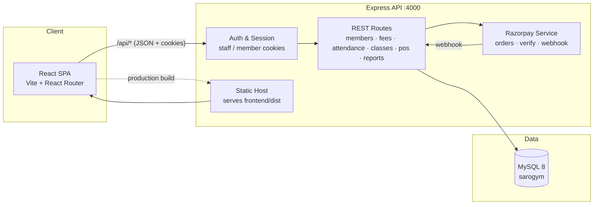

- **Dual session model.** `requireAuth` guards all staff routes; `requireMemberAuth` guards `/api/portal/*`, so a member session can only ever reach its own data.
- **Server owns the money.** Subscriptions expose `balance_due` and `payment_status` as SQL **generated columns**, so balances can never drift from the payment ledger.
- **Razorpay is isolated.** All gateway logic lives in `backend/services/razorpayPayments.js`; a safe **demo mode** runs when no keys are configured.

---

## Project Structure

```
.
├── backend/                    # Express API (port 4000)
│   ├── server.js               # App bootstrap, security headers, static host, route mounts
│   ├── database/db.js          # mysql2 pool + schema bootstrap + seed data
│   ├── routes/                 # REST route modules (see API Reference)
│   │   ├── auth.js             # staff/member login, OTP, Google OAuth
│   │   ├── memberPortal.js     # member self-service (own data only)
│   │   ├── fees.js             # plans, subscriptions, payments, Razorpay orders/verify
│   │   └── ...
│   ├── services/
│   │   └── razorpayPayments.js # gateway wrapper + finalize logic
│   ├── reset-admin.js          # utility: reset the admin password
│   ├── .env.example            # backend environment template
│   └── package.json
│
├── frontend/                   # Vite + React SPA (dev port 3000)
│   ├── src/
│   │   ├── App.jsx             # routes
│   │   ├── pages/              # Dashboard, Members, Fees, Attendance, ... MemberPortal
│   │   ├── components/         # Layout, Modal, RazorpayCheckout, QR scanner, ...
│   │   ├── api.js              # fetch wrapper + creator signature fragment
│   │   ├── utils.js            # helpers + creator signature fragment
│   │   ├── signature.js        # runtime authorship watermark
│   │   └── style.css           # design system
│   ├── .env.example
│   └── package.json
│
├── database/
│   └── schema.sql              # full MySQL schema (+ optional seed)
│
├── docs/screenshots/           # README screenshots
├── LICENSE
└── README.md
```

---

## Getting Started

Follow the five steps below to get the whole system running locally in a few minutes.

### Prerequisites

| Requirement | Version |
| --- | --- |
| [Node.js](https://nodejs.org) | **18 or newer** (with npm) |
| [MySQL](https://www.mysql.com) or MariaDB | **8.0+** / 10.4+ |
| [Docker](https://www.docker.com) *(optional)* | For the quickest database setup |
| A modern browser | Chrome / Edge / Firefox |

### Step 1 — Clone the repository

```bash
git clone https://github.com/sabynextdoor/HazeFitness.git
cd HazeFitness
```

### Step 2 — Create the MySQL database

Pick **one** of the two options below.

**Option A — Docker (fastest, recommended for a first run):**

```bash
docker run --name gym-mysql \
  -e MYSQL_ROOT_PASSWORD=rootpass123 \
  -p 3306:3306 -d mysql:8
```

Wait ~20 seconds for MySQL to boot, then load the schema:

```bash
# Linux / macOS / Git Bash
docker exec -i gym-mysql mysql -uroot -prootpass123 < database/schema.sql

# Windows PowerShell
Get-Content database/schema.sql | docker exec -i gym-mysql mysql -uroot -prootpass123
```

**Option B — Local MySQL server:**

```sql
CREATE DATABASE sarogym CHARACTER SET utf8mb4 COLLATE utf8mb4_unicode_ci;
```

```bash
mysql -uroot -p sarogym < database/schema.sql
```

> The backend can also create missing tables automatically on first boot
> (`database/db.js` runs the schema bootstrap), but loading `database/schema.sql`
> explicitly is the cleanest and fastest path.

### Step 3 — Configure and run the backend

```bash
cd backend
npm install
```

Create your environment file from the template and edit the DB values:

```bash
# Linux / macOS
cp .env.example .env

# Windows PowerShell
Copy-Item .env.example .env
```

Minimum values to check in `backend/.env`:

```env
DB_HOST=localhost
DB_PORT=3306
DB_USER=root
DB_PASSWORD=rootpass123
DB_NAME=sarogym

ADMIN_USERNAME=hazeadmin
ADMIN_PASSWORD=Haze@12345
PORT=4000
NODE_ENV=development
```

Start the API:

```bash
npm start
```

You should see:

```
==============================================
  Haze Fitness GMS 1.0  ·  http://localhost:4000
  Crafted & signed by Saby — HF-GMS
==============================================
```

Confirm it's healthy: **http://localhost:4000/api/health** → `{ "status": "ok", ... }`

### Step 4 — Run the frontend (development)

In a **second terminal**:

```bash
cd frontend
npm install

# Linux / macOS
cp .env.example .env
# Windows PowerShell
Copy-Item .env.example .env

npm run dev
```

Open **http://localhost:3000** and sign in with the [default credentials](#default-credentials).
Vite proxies all `/api` calls to the backend on port 4000.

### Step 5 — Production build (single-server deploy)

Build the SPA, then let the backend serve the whole app from one port:

```bash
cd frontend
npm run build        # outputs frontend/dist/
```

Now run **only** the backend and open **http://localhost:4000** — Express serves `frontend/dist` as static files with an `index.html` fallback for client-side routes.

### Run with Docker

Prefer containers? A multi-stage `Dockerfile` and a `docker-compose.yml` bring up **MySQL + the full app** with one command — no local Node or MySQL needed.

```bash
docker compose up --build
```

Then open **http://localhost:4000** (staff login: `hazeadmin` / `Haze@12345`). The database is seeded from `database/schema.sql` on first boot. To reset everything:

```bash
docker compose down -v && docker compose up --build
```

**Run the prebuilt image** (published to GitHub Container Registry):

```bash
docker run -d --name hazefitness \
  -p 4000:4000 \
  -e DB_HOST=host.docker.internal \
  -e DB_USER=root -e DB_PASSWORD=rootpass123 -e DB_NAME=sarogym \
  -e ADMIN_USERNAME=hazeadmin -e ADMIN_PASSWORD=Haze@12345 \
  ghcr.io/sabynextdoor/hazefitness:latest
```

> Replace `host.docker.internal` with your MySQL host. Every image is built and
> published automatically by [`.github/workflows/docker-publish.yml`](.github/workflows/docker-publish.yml).

### Default credentials

| Portal | Username | Password |
| --- | --- | --- |
| **Staff / Admin** | `hazeadmin` | `Haze@12345` |
| **Member** *(demo account)* | `hazeadmin` or phone `9000000099` | `Haze@12345` |

> ⚠️ **Change these before any real deployment** — set `ADMIN_USERNAME` / `ADMIN_PASSWORD` in `backend/.env` and reset the database admin row (`node reset-admin.js`).
>
> On the login screen, choose the **Staff / Admin** or **Member** tab to enter the matching portal.

### Email OTP in this demo

No SMTP provider is bundled, so **OTP codes are printed to the backend console**. Select **Email OTP** on the login screen, submit your email, and read the 6-digit code from the terminal running `npm start`.

---

## Environment Variables

### Backend (`backend/.env`)

| Variable | Required | Default | Description |
| --- | --- | --- | --- |
| `DB_HOST` | ✅ | `localhost` | MySQL host |
| `DB_PORT` | ✅ | `3306` | MySQL port |
| `DB_USER` | ✅ | `root` | MySQL user |
| `DB_PASSWORD` | ✅ | — | MySQL password |
| `DB_NAME` | ✅ | `sarogym` | Database name |
| `DB_SSL` | — | `false` | Set `true` for managed DBs requiring TLS |
| `PORT` | — | `4000` | API port |
| `NODE_ENV` | — | `development` | `production` disables demo payment mode |
| `FRONTEND_ORIGINS` | — | `localhost:3000,5173,4000` | Comma-separated CORS allow-list |
| `ADMIN_USERNAME` | — | `hazeadmin` | Seeded admin username |
| `ADMIN_PASSWORD` | — | `Haze@12345` | Seeded admin password |
| `ADMIN_EMAIL` | — | — | Seeded admin email |
| `ALLOW_PUBLIC_STAFF_SIGNUP` | — | `false` | Allow open staff self-signup |
| `RAZORPAY_KEY_ID` | — | — | Razorpay key id (enables live checkout) |
| `RAZORPAY_KEY_SECRET` | — | — | Razorpay key secret |
| `RAZORPAY_WEBHOOK_SECRET` | — | — | Razorpay webhook signing secret |
| `CLERK_DOMAIN` / `CLERK_SECRET_KEY` | — | — | Enable Google sign-in via Clerk |
| `GOOGLE_CLIENT_ID` / `GOOGLE_CLIENT_SECRET` / `GOOGLE_CALLBACK_URL` | — | — | Google OAuth (if not using Clerk) |

### Frontend (`frontend/.env`)

| Variable | Required | Description |
| --- | --- | --- |
| `VITE_BACKEND_URL` | — | Absolute backend URL for the dev proxy (defaults to same-origin `/api`) |

---

## Online Payments with Razorpay

1. Create test/live keys in the [Razorpay Dashboard](https://dashboard.razorpay.com).
2. Add them to `backend/.env`:

   ```env
   RAZORPAY_KEY_ID=rzp_test_xxxxxxxx
   RAZORPAY_KEY_SECRET=xxxxxxxx
   RAZORPAY_WEBHOOK_SECRET=xxxxxxxx
   ```

3. In the app, open a member with a **balance due** → **Record Payment** → choose **Online (Razorpay)** → confirm the amount. Razorpay Checkout opens (UPI / Card / NetBanking / Wallet). On success the payment is **verified server-side by signature** and recorded with `payment_mode = 'online'`.

**Demo mode (no keys configured):** when `RAZORPAY_KEY_ID` is absent and `NODE_ENV !== production`, the app opens a built-in Razorpay-styled popup and records a **mock** order/payment so you can exercise the full flow locally.

Webhook endpoint (configure in the Razorpay dashboard): `POST /api/razorpay/webhook`.

---

## API Reference

Base URL: **`/api`** · All protected routes use HTTP-only cookie sessions. `Staff` routes require a staff session; `Portal` routes require a member session.

<details>
<summary><b>Auth</b> — <code>/api/auth</code></summary>

| Method | Endpoint | Description |
| --- | --- | --- |
| POST | `/auth/login` | Staff login (username/email + password) |
| POST | `/auth/member-login` | Member login (phone/email/username + password) |
| POST | `/auth/signup` | Create a staff account (if enabled) |
| POST | `/auth/member-signup` | Member self-signup |
| POST | `/auth/request-otp` | Email a one-time code |
| POST | `/auth/verify-otp` | Verify OTP and start a session |
| GET | `/auth/me` | Current session |
| POST | `/auth/logout` | End session |
| GET | `/auth/google` · `/auth/google/callback` | Google OAuth flow |
| GET | `/auth/google/config` | OAuth availability |
</details>

<details>
<summary><b>Dashboard</b> &nbsp;<b>Members</b> &nbsp;<b>Trainers</b></summary>

| Method | Endpoint | Description |
| --- | --- | --- |
| GET | `/dashboard` | Overview KPIs (active members, attendance, collection) |
| GET/POST | `/members` | List / create members |
| GET/PUT/DELETE | `/members/:id` | Read / update / remove a member |
| GET | `/members/:id/history` | Payments & attendance history |
| POST | `/members/:id/progress` | Record a progress entry |
| POST | `/members/:id/trainer-assignment` | Assign a trainer |
| GET/POST | `/trainers` | List / create trainers |
| GET/PUT/DELETE | `/trainers/:id` | Manage a trainer |
</details>

<details>
<summary><b>Fees & Payments</b> — <code>/api/fees</code></summary>

| Method | Endpoint | Description |
| --- | --- | --- |
| GET/POST | `/fees/subscriptions` | List / create subscriptions |
| PUT/DELETE | `/fees/subscriptions/:id` | Update / delete a subscription |
| POST | `/fees/payments` | Record a manual payment (cash/upi/card/other) |
| POST | `/fees/payments/orders` | Create a Razorpay order (or mock) |
| POST | `/fees/payments/verify` | Verify + record an online payment |
| GET | `/fees/receipt/:paymentId` | Printable receipt data |
| GET/POST/PUT/DELETE | `/plans` · `/plans/:id` | Fee plans & offers |
</details>

<details>
<summary><b>Attendance</b> &nbsp;<b>Classes</b> &nbsp;<b>Workout & Diet</b></summary>

| Method | Endpoint | Description |
| --- | --- | --- |
| GET | `/attendance` | Attendance log |
| POST | `/attendance/checkin` · `/attendance/checkout` · `/attendance/toggle` | Check-in / out |
| GET/POST | `/classes` | List / create classes & slots |
| PUT/DELETE | `/classes/:id` | Update / delete a class |
| GET | `/classes/:id/bookings` | Bookings for a class |
| POST | `/classes/:id/book` | Book a member into a class |
| GET/POST/DELETE | `/fitness-plans/workout…` | Workout plans |
| GET/POST/DELETE | `/fitness-plans/diet…` | Diet plans |
</details>

<details>
<summary><b>POS</b> &nbsp;<b>Reports</b> &nbsp;<b>Announcements</b></summary>

| Method | Endpoint | Description |
| --- | --- | --- |
| GET/POST | `/pos/products` | Products |
| PUT/DELETE | `/pos/products/:id` | Manage a product |
| GET/POST | `/pos/sales` | List / record sales |
| GET | `/reports/members-status` · `/reports/monthly-collection` · `/reports/pending-dues` | Report feeds |
| GET | `/reports/attendance-trend` · `/reports/peak-attendance` | Attendance analytics |
| GET/POST/PUT/DELETE | `/announcements` | Announcements |
</details>

<details>
<summary><b>Member Portal</b> — <code>/api/portal</code> (own data only)</summary>

| Method | Endpoint | Description |
| --- | --- | --- |
| GET | `/portal/me` | Own profile & membership |
| GET | `/portal/payments` · `/portal/receipt/:paymentId` | Payment history & receipts |
| POST | `/portal/payments/orders` · `/portal/payments/verify` | Pay online |
| GET | `/portal/attendance` · `/portal/attendance-streak` | Attendance & streak |
| GET | `/portal/classes` · `/portal/bookings` | Browse & view bookings |
| POST/DELETE | `/portal/classes/:id/book` · `/portal/bookings/:id` | Book / cancel |
| GET | `/portal/workout` · `/portal/diet` · `/portal/announcements` | Assigned plans & notices |
</details>

<details>
<summary><b>Payments Webhook & Health</b></summary>

| Method | Endpoint | Description |
| --- | --- | --- |
| POST | `/razorpay/webhook` | Razorpay webhook (raw-body signature verified) |
| GET | `/health` | Liveness probe |
</details>

---

## Deployment

**Single-server (recommended).** Build the frontend and run the backend — one process serves the API and the SPA:

```bash
cd frontend && npm run build && cd ..
NODE_ENV=production node backend/server.js
```

**Checklist before going live**

- [ ] Set `NODE_ENV=production` (disables payment demo mode).
- [ ] Set a **strong** `ADMIN_PASSWORD` and a real `ADMIN_USERNAME` / `ADMIN_EMAIL`.
- [ ] Point `DB_*` at a managed MySQL instance; set `DB_SSL=true` if required.
- [ ] Restrict `FRONTEND_ORIGINS` to your real domain(s).
- [ ] Configure Razorpay keys **and** the webhook secret.
- [ ] Put the app behind HTTPS (reverse proxy or platform TLS) so cookies are sent as `Secure`.
- [ ] Keep `ALLOW_PUBLIC_STAFF_SIGNUP=false`.

---

## Security

- **HTTP-only cookie sessions**, with staff and member sessions kept strictly separate (`requireAuth` vs `requireMemberAuth`).
- **No SQL string interpolation** — every query is parameterised through `mysql2`.
- **Password hashing** for member credentials; admin credentials are seeded from environment variables.
- **Rate limiting** on `/auth/login`, `/auth/member-login` and `/auth/signup` (10 attempts / 15 min per IP).
- **Hardened headers:** `X-Content-Type-Options: nosniff`, `X-Frame-Options: DENY`, `Referrer-Policy: strict-origin-when-cross-origin`, and a locked-down `Permissions-Policy` (camera only for self).
- **CORS allow-list** via `FRONTEND_ORIGINS`.
- **Razorpay signatures** are verified server-side before any payment is recorded; webhooks are verified against the raw request body.

> Found a vulnerability? Please open a **private security advisory** on GitHub rather than a public issue.

---

## Troubleshooting

| Symptom | Fix |
| --- | --- |
| `ECONNREFUSED 127.0.0.1:3306` | MySQL isn't running / wrong `DB_*` values. Start the DB (`docker start gym-mysql`) and re-check `backend/.env`. |
| `Unknown database 'sarogym'` | Run `database/schema.sql` (Step 2) or create the database manually. |
| Login says invalid credentials | Use `hazeadmin` / `Haze@12345`, or reset: `cd backend && node reset-admin.js`. |
| `Access blocked by CORS` | Add your frontend origin to `FRONTEND_ORIGINS` and restart the backend. |
| OTP never arrives | By design — the code is printed in the **backend terminal** (no SMTP bundled). |
| Online payment opens a mock popup | Expected without Razorpay keys (`NODE_ENV !== production`). Add keys to enable live checkout. |
| Port already in use | Change `PORT` in `backend/.env` (and the Vite proxy / `VITE_BACKEND_URL`). |

---

## Roadmap

- [ ] Membership auto-renewal & expiry notifications
- [ ] SMS / WhatsApp deep integration for reminders
- [ ] Granular staff roles & permissions
- [ ] Docker Compose for one-command local stack
- [ ] Automated test suite (API + component)

---

## Contributing

Contributions are welcome.

1. Fork the repository.
2. Create a feature branch: `git checkout -b feat/my-feature`.
3. Commit with a clear message: `git commit -m "feat: add my feature"`.
4. Push and open a Pull Request.

Please keep PRs focused, match the existing code style, and never commit secrets (`.env` files are git-ignored).

---

## Author

**Saby** — design, engineering and architecture.

- GitHub: [@sabynextdoor](https://github.com/sabynextdoor)
- Project: [HazeFitness](https://github.com/sabynextdoor/HazeFitness)

This project is watermarked for authorship. Runtime and build layers carry a hidden creator signature, and every API response includes `X-Crafted-By: Saby <Haze Fitness GMS>`. Please keep the watermark and attribution intact if you fork it.

---

## Changelog

See [CHANGELOG.md](CHANGELOG.md) for a full list of changes, and the
[releases page](https://github.com/sabynextdoor/HazeFitness/releases) for
versioned builds and Docker images.

---

## License

Released under the **MIT License** — see [LICENSE](LICENSE) for details.

<div align="center"><sub>Built with care by Saby · © 2026 Haze Fitness</sub></div>
